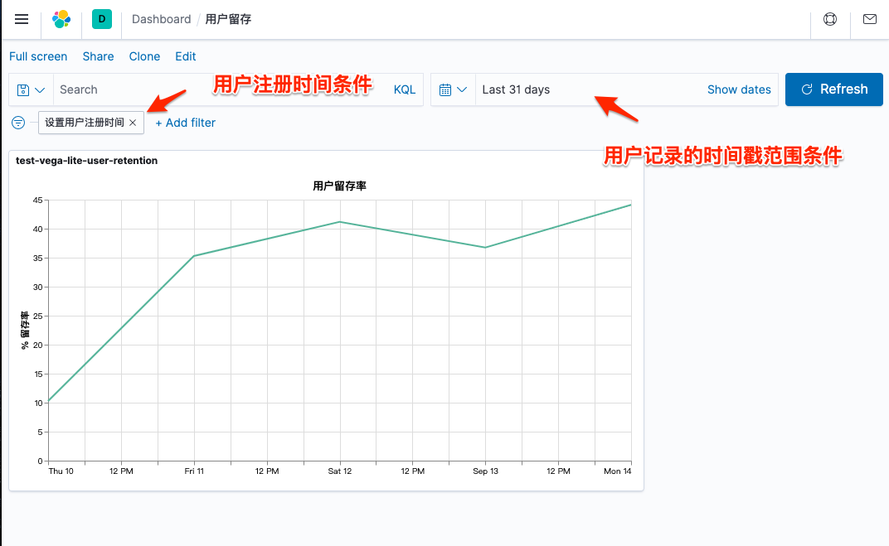

# 用户留存数据的可视化

<!-- @import "[TOC]" {cmd="toc" depthFrom=2 depthTo=6 orderedList=false} -->

<!-- code_chunk_output -->

- [查询和聚合命令](#查询和聚合命令)
  - [指定日期的新注册用户数](#指定日期的新注册用户数)
  - [继续分组统计每天的留存用户数](#继续分组统计每天的留存用户数)
- [基于 Vega-lite 的可视化组件](#基于-vega-lite-的可视化组件)
  - [介绍](#介绍)
  - [默认的 Vega-lite 代码](#默认的-vega-lite-代码)
  - [用户数据按天文档数折线图](#用户数据按天文档数折线图)
  - [增加查询过滤条件：指定日期注册用户](#增加查询过滤条件指定日期注册用户)
  - [显示留存率](#显示留存率)
  - [保存为可视化组件](#保存为可视化组件)
  - [有待细化的任务](#有待细化的任务)

<!-- /code_chunk_output -->

## 查询和聚合命令

### 指定日期的新注册用户数

精确的用户数，需要统计当日`signup`事件的总数：

```
POST /user-events-0915-1/_search
{
  "size": 0,
  "query": {
    "bool": {
      "filter": [
        {
          "range": {
            "create_at": {
              "gte": "2020-09-10",
              "lte": "2020-09-11",
              "format": "yyyy-MM-dd",
              "time_zone": "+08:00"
            }
          }
        }
      ]
    }
  },
  "aggs": {
    "signup_users": {
      "filter": {
        "term": {
          "type": "signup"
        }
      }
    }
  }
}
```

返回结果类似：

```json
{
  "took": 4,
  "timed_out": false,
  "_shards": {
    "total": 1,
    "successful": 1,
    "skipped": 0,
    "failed": 0
  },
  "hits": {
    "total": {
      "value": 293,
      "relation": "eq"
    },
    "max_score": null,
    "hits": []
  },
  "aggregations": {
    "signup_users": {
      "doc_count": 68
    }
  }
}
```

`"doc_count" : 68`，既是当天注册的总用户数

不精确的做法，聚合时使用`cardinality`基数指标聚合，那么得到的近似值，可能会出现不>6%的误差。如：

```
POST /user-events-0915-1/_search
{
  "size": 0,
  "query": {
    "bool": {
      "filter": [
        {
          "range": {
            "create_at": {
              "gte": "2020-09-10",
              "lte": "2020-09-11",
              "format": "yyyy-MM-dd",
              "time_zone": "+08:00"
            }
          }
        }
      ]
    }
  },
  "aggs": {
    "signup_users": {
      "filter": {
        "term": {
          "type": "signup"
        }
      },
      "aggs": {
        "users_count": {
          "cardinality": {
            "field": "user_id"
          }
        }
      }
    }
  }
}
```

返回结果类似：

```json
{
  "took": 5,
  "timed_out": false,
  "_shards": {
    "total": 1,
    "successful": 1,
    "skipped": 0,
    "failed": 0
  },
  "hits": {
    "total": {
      "value": 293,
      "relation": "eq"
    },
    "max_score": null,
    "hits": []
  },
  "aggregations": {
    "signup_users": {
      "doc_count": 68,
      "users_count": {
        "value": 68
      }
    }
  }
}
```

- 当数据量较大时会出现误差

### 继续分组统计每天的留存用户数

聚合 aggregation 可以并列和级联，这样可以在一次查询中得出：

- 指定日期注册的用户总数
- 之后各天留存的用户总数

这样为后续比如用 vega 展示数据提供了条件，vega 不支持发起两次查询。

也带来一点副作用，聚合是串行的，有时候并行多个查询可能性能更好一些，在资源充裕的前提下。

```
POST /user-events-0915-1/_search
{
  "size": 0,
  "query": {
    "bool": {
      "filter": [
        {
          "range": {
            "create_at": {
              "gte": "2020-09-10",
              "lte": "2020-09-11",
              "format": "yyyy-MM-dd",
              "time_zone": "+08:00"
            }
          }
        }
      ]
    }
  },
  "aggs": {
    "signup_users": {
      "filter": {
        "term": {
          "type": "signup"
        }
      }
    },
    "retention_users":{
      "filter": {
        "term": {
          "type": "play_game"
        }
      },
      "aggs": {
        "by_days": {
          "date_histogram": {
            "field": "@timestamp",
            "calendar_interval":"1d",
            "time_zone": "+08:00"
          },
          "aggs": {
            "user_counts": {
              "cardinality": {
                "field": "user_id"
              }
            }
          }
        }
      }
    }
  }
}
```

返回结果类似：

```json
{
  "took": 17,
  "timed_out": false,
  "_shards": {
    "total": 1,
    "successful": 1,
    "skipped": 0,
    "failed": 0
  },
  "hits": {
    "total": {
      "value": 293,
      "relation": "eq"
    },
    "max_score": null,
    "hits": []
  },
  "aggregations": {
    "signup_users": {
      "doc_count": 68
    },
    "retention_users": {
      "doc_count": 157,
      "by_days": {
        "buckets": [
          {
            "key_as_string": "2020-09-10 00:00:00",
            "key": 1599667200000,
            "doc_count": 8,
            "user_counts": {
              "value": 7
            }
          },
          {
            "key_as_string": "2020-09-11 00:00:00",
            "key": 1599753600000,
            "doc_count": 31,
            "user_counts": {
              "value": 24
            }
          },
          {
            "key_as_string": "2020-09-12 00:00:00",
            "key": 1599840000000,
            "doc_count": 37,
            "user_counts": {
              "value": 28
            }
          },
          {
            "key_as_string": "2020-09-13 00:00:00",
            "key": 1599926400000,
            "doc_count": 39,
            "user_counts": {
              "value": 25
            }
          },
          {
            "key_as_string": "2020-09-14 00:00:00",
            "key": 1600012800000,
            "doc_count": 42,
            "user_counts": {
              "value": 30
            }
          }
        ]
      }
    }
  }
}
```

- aggs 支持 filter，比如 `retention_users` 下的 filter，可用于进一步精确结果集合
- `by_days` aggs 下的`user_counts`使用的是`cardinality`，因此是估算值
- 只要涉及排重，就不可避免的使用`cardinality`，除非数据结构建模时能避免重复，比如`signup`理论上只能做一次

## 基于 Vega-lite 的可视化组件

### 介绍

- 如果想通过 Kibana 的 Virtualization 展示汇总的数据
  ，需要选择它提供的组件类型
- 目前看除了使用 Vega 组件，其他组件都无法解析并展示复杂结构的汇总数据
- Kibana 目前对 Vega 的支持是试验性的，后续版本可能会有变化或者取消
- Vega 是一个独立的开源可视化图表组件框架和工具集
- Vega 功能强大而复杂，因此后续推出了简化的 Vega-lite
- Kibana 的 Vega 组件既支持 Vega 也支持 Vega-lite
- 下面的示例使用的是 Vega-lite

### 默认的 Vega-lite 代码

Kibana 内创建 Vega 组件，需要编写声明式的代码，有 json 和 hjson 两种形式，使用 json 形式较好，因为可以直接粘贴 Elasticsearch 查询语句进来。

以下 Kibana 是默认的代码：

```json
{
  "$schema": "https://vega.github.io/schema/vega-lite/v4.json",
  "title": "Event counts from all indexes",
  "data": {
    "url": {
      "%context%": true,
      "%timefield%": "@timestamp",
      "index": "_all",
      "body": {
        "aggs": {
          "time_buckets": {
            "date_histogram": {
              "field": "@timestamp",
              "interval": { "%autointerval%": true },
              "extended_bounds": {
                "min": { "%timefilter%": "min" },
                "max": { "%timefilter%": "max" }
              },
              "min_doc_count": 0
            }
          }
        },
        "size": 0
      }
    },
    "format": { "property": "aggregations.time_buckets.buckets" }
  },
  "mark": "line",
  "encoding": {
    "x": { "field": "key", "type": "temporal", "axis": { "title": false } },
    "y": {
      "field": "doc_count",
      "type": "quantitative",
      "axis": { "title": "Document count" }
    }
  }
}
```

- 你可以拿默认代码当作代码脚手架，逐步添加自定义的逻辑
- 默认代码以当前 Elasticsearch 所有索引获取时间和文档数为 x 轴和 y 轴绘制折线图

### 用户数据按天文档数折线图

对上述语句稍作改动，就可以展示用户数据按天显示文档数：

```json
{
  "$schema": "https://vega.github.io/schema/vega-lite/v4.json",
  "title": "Event counts from all indexes",
  "data": {
    "url": {
      "%timefield%": "@timestamp",
      "index": "user-events-0915-1",
      "body": {
        "aggs": {
          "time_buckets": {
            "date_histogram": {
              "field": "@timestamp",
              "calendar_interval": "1d"
            }
          }
        },
        "size": 0
      }
    },
    "format": { "property": "aggregations.time_buckets.buckets" }
  },
  "mark": "line",
  "encoding": {
    "x": { "field": "key", "type": "temporal", "axis": { "title": false } },
    "y": {
      "field": "doc_count",
      "type": "quantitative",
      "axis": { "title": "Document count" }
    }
  }
}
```

### 增加查询过滤条件：指定日期注册用户

```json
{
  "$schema": "https://vega.github.io/schema/vega-lite/v4.json",
  "title": "Event counts from all indexes",
  "data": {
    "url": {
      "index": "user-events-0915-1",
      "body": {
        "query": {
          "bool": {
            "filter": [
              {
                "range": {
                  "create_at": {
                    "gte": "2020-09-10",
                    "lte": "2020-09-11",
                    "format": "yyyy-MM-dd",
                    "time_zone": "+08:00"
                  }
                }
              }
            ]
          }
        },
        "aggs": {
          "time_buckets": {
            "date_histogram": {
              "field": "@timestamp",
              "calendar_interval": "1d"
            }
          }
        },
        "size": 0
      }
    },
    "format": { "property": "aggregations.time_buckets.buckets" }
  },
  "mark": "line",
  "encoding": {
    "x": { "field": "key", "type": "temporal", "axis": { "title": false } },
    "y": {
      "field": "doc_count",
      "type": "quantitative",
      "axis": { "title": "Document count" }
    }
  }
}
```

### 显示留存率

```json
{
  "$schema": "https://vega.github.io/schema/vega-lite/v4.json",
  "title": "用户留存率",
  "data": {
    "url": {
      "index": "user-events-0915-1",
      "body": {
        "query": {
          "bool": {
            "filter": [
              {
                "range": {
                  "create_at": {
                    "gte": "2020-09-10",
                    "lte": "2020-09-11",
                    "format": "yyyy-MM-dd",
                    "time_zone": "+08:00"
                  }
                }
              }
            ]
          }
        },
        "aggs": {
          "signup_users": {
            "filter": {
              "term": {
                "type": "signup"
              }
            }
          },
          "retention_users": {
            "filter": {
              "term": {
                "type": "play_game"
              }
            },
            "aggs": {
              "by_days": {
                "date_histogram": {
                  "field": "@timestamp",
                  "calendar_interval": "1d",
                  "time_zone": "+08:00"
                },
                "aggs": {
                  "user_counts": {
                    "cardinality": {
                      "field": "user_id"
                    }
                  }
                }
              }
            }
          }
        },
        "size": 0
      }
    },
    "format": {
      "property": "aggregations"
    }
  },
  "transform": [
    { "calculate": "datum.signup_users.doc_count", "as": "total_users" },
    { "calculate": "datum.retention_users.by_days.buckets", "as": "results" },
    { "flatten": ["results"], "as": "r" },
    {
      "calculate": "datum.r.user_counts.value/datum.total_users*100",
      "as": "retention_rate"
    }
  ],
  "mark": "line",
  "encoding": {
    "x": {
      "field": "r.key",
      "type": "temporal",
      "axis": {
        "title": false
      }
    },
    "y": {
      "field": "retention_rate",
      "type": "quantitative",
      "axis": {
        "title": "% 留存率"
      }
    }
  }
}
```

- `body` 部分相当于 Elasticsearch 查询语句的数据部分
- `"format": {` 子句将 Elasticsearch 返回数据对象的某个成员交给 Vega-lite 去处理
- `"transform": [` 将转换从 format 子句得到的数据
- `"encoding": {` 子句将转换后的数据做编码，这里是指定横竖坐标显示的数据
- 有问题或者需要自定义处理，可查[Viga-lite Documentation](https://vega.github.io/vega-lite/docs/)

### 保存为可视化组件

之前的 vega，已经能工作了，但是要想保存为 Virtaulization 组件，就不能将注册用户时间范围写死在代码中：

```json
{
  "$schema": "https://vega.github.io/schema/vega-lite/v4.json",
  "title": "用户留存率",
  "data": {
    "url": {
      "index": "user-events-0915-1",
      "body": {
        "query": {
          "bool": {
            "filter": [
              {
                "range": {
                  "create_at": {
                    "gte": "2020-09-10",
                    "lte": "2020-09-11",
                    "format": "yyyy-MM-dd",
                    "time_zone": "+08:00"
                  }
                }
              }
            ]
          }
        },
..
```

而应该这样写，接受来自外界设置的 filter 条件：

```json
{
  "$schema": "https://vega.github.io/schema/vega-lite/v4.json",
  "title": "用户留存率",
  "data": {
    "url": {
      "index": "user-events-0915-1",
      "body": {
        "query": {
          "bool": {
            "filter": ["%dashboard_context-filter_clause%"]
          }
        },
        "aggs": {
          "signup_users": {
            "filter": {
              "term": {
                "type": "signup"
              }
            }
          },
          "retention_users": {
            "filter": {
              "term": {
                "type": "play_game"
              }
            },
            "aggs": {
              "by_days": {
                "date_histogram": {
                  "field": "@timestamp",
                  "calendar_interval": "1d",
                  "time_zone": "+08:00"
                },
                "aggs": {
                  "user_counts": {
                    "cardinality": {
                      "field": "user_id"
                    }
                  }
                }
              }
            }
          }
        },
        "size": 0
      }
    },
    "format": {
      "property": "aggregations"
    }
  },
  "transform": [
    { "calculate": "datum.signup_users.doc_count", "as": "total_users" },
    { "calculate": "datum.retention_users.by_days.buckets", "as": "results" },
    { "flatten": ["results"], "as": "r" },
    {
      "calculate": "datum.r.user_counts.value/datum.total_users*100",
      "as": "retention_rate"
    }
  ],
  "mark": "line",
  "encoding": {
    "x": {
      "field": "r.key",
      "type": "temporal",
      "axis": {
        "title": false
      }
    },
    "y": {
      "field": "retention_rate",
      "type": "quantitative",
      "axis": {
        "title": "% 留存率"
      }
    }
  }
}
```

保存 Virtualization 组件后，可在 Dashboard 上`Add filter`，加入类似如下内容：

```json
{
  "range": {
    "create_at": {
      "format": "yyyy-MM-dd",
      "gte": "2020-09-10",
      "lte": "2020-09-11",
      "time_zone": "+08:00"
    }
  }
}
```

另外，可设置`Custom label`，比如“设置用户注册时间”，那么保存后的 Dashboard 将类似这样：



### 有待细化的任务

- 生成的折线图缺乏展示数据交互细节，Vega-lite 提供了这方面的支持
- x轴日期显示不够友好，需要做定制处理
